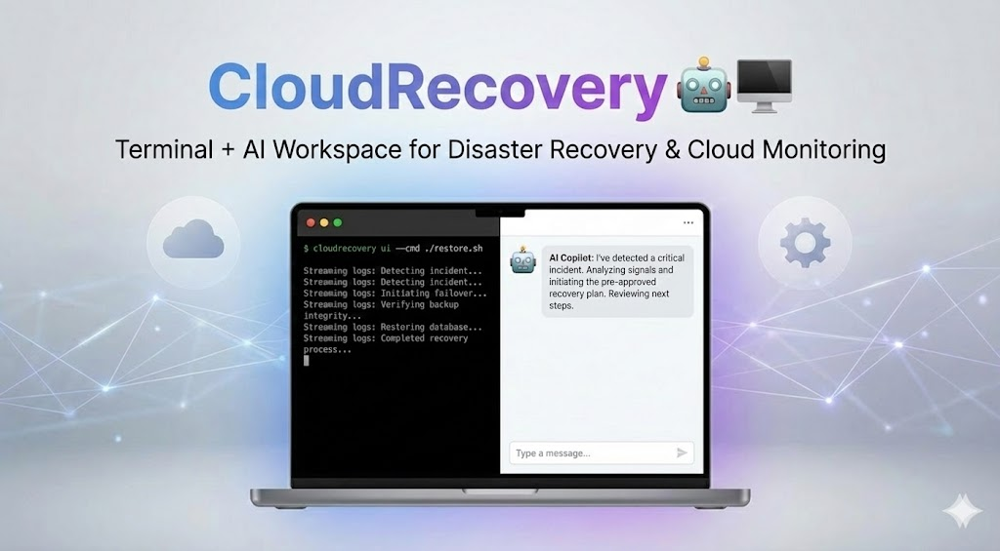

# CloudRecovery 🛟🤖🖥️
**Terminal + AI Workspace for Disaster Recovery, Cloud Monitoring, Site-Down Assistant & DDoS Safeguard (Local-First, Enterprise-Ready)**  
*(“second brother” of CloudDeploy — same architecture, new mission: restore service fast, safely, and auditably.)*




If you've ever lost hours during an outage because logs are scattered, tools are inconsistent, approvals are unclear, or everyone is guessing — **CloudRecovery** is for you.

CloudRecovery is a **recovery workspace** that runs your **real ops/DR CLIs** in a browser (left panel), while an **AI SRE copilot** (right panel) consumes **sanitized, live signals** (alerts/events/logs/synthetics) and turns chaos into an **executable, policy-guarded recovery plan** — with **always-on monitoring agents** and **autopilot modes** designed for **safe MTTR reduction**.

⭐ If CloudRecovery saves you even one incident, please **star the repo**.

---

## ✨ Highlights

- 🖥️ **Real Terminal in the Browser** (PTY-backed, not fake logs)
- 🔁 **Live Streaming Output** + prompt detection (CloudDeploy DNA)
- 🤖 **AI Copilot** reads **sanitized** terminal tail + incident signals
- 🎯 **Plan → Approve → Execute** recovery workflow (commands are never executed silently)
- 🧰 **MCP Tool Server** (same tool layer powers UI + agents — no duplicated automation)
- 🧾 **Audit-Friendly UX**: timeline, evidence snapshots, approvals, post-incident summary
- 🟥 **OpenShift (OCP) Support**: watch events/pods, rollout actions, safe restarts/rollback (policy-gated)
- ☁️ **Hybrid Estate Support**: OpenShift + Oracle instances + EC2 instances
- 🧑‍✈️ **Human-in-the-loop by default** (prod-safe), **Autopilot when enabled**
- 🕒 **24/7 Monitoring via Linux Agent daemon** (systemd service)

---

## 🧠 What is CloudRecovery?

CloudRecovery combines **four** things into one workflow:

### 1) Web Workspace (Terminal + AI)
- Runs a real PTY-backed terminal session in your browser
- Streams output live
- Detects interactive prompts & steps
- Shows **Assistant / Summary / Issues** in a clean enterprise UI

### 2) AI Incident Copilot
- Reads **redacted** terminal output + evidence (redaction by default)
- Explains what’s happening in plain language
- Produces **ranked hypotheses**
- Generates executable plans and runbooks
- Helps troubleshoot failures with safe, actionable steps

### 3) MCP Server (Tooling Interface)
- Exposes terminal + recovery actions as tools (stdio MCP)
- Enables external orchestrators/agents to observe and act (policy-guarded)
- Same tool layer powers UI autopilot

### 4) Always-on Linux Agents (24/7)
- A daemon installed on Linux hosts (systemd)
- Continuously collects health + OpenShift signals
- Pushes evidence to the control plane
- (When enabled) executes **approved runbooks** under policy gates

---

## 🏢 Why teams adopt CloudRecovery (Enterprise mindset)

- 👩‍💻 **Faster onboarding:** same recovery UX across engineers and environments
- 🔥 **Lower MTTR:** less “where do I look?” time — evidence is pulled automatically
- 🧾 **Audit-ready:** evidence + actions + approvals + timeline export
- 🛡️ **Safe automation:** policies + risk labels + approvals + two-person gates
- 🧩 **Extensible:** add providers, WAF/CDN connectors, runbook packs, and policy packs
- 🏠 **Local-first / Bastion-friendly:** run in an ops workstation, jump host, or hardened runner

---

## 🧱 Architecture (Control Plane + Agents)

### Control Plane (FastAPI + Web UI)
- Hosts the terminal workspace + AI copilot
- Receives evidence from agents
- Streams evidence via WebSocket: **`/ws/signals`**
- Agent APIs:
  - `POST /api/agent/heartbeat`
  - `POST /api/agent/evidence`
  - `GET  /api/agent/commands` (poll channel; can be upgraded to WS)
  - `POST /api/agent/command` (enqueue)
  - `GET  /api/evidence/tail`
- Health endpoint: **`GET /health`**

### Agent (Linux systemd daemon)
- Collectors:
  - `agent:host` (CPU/mem/disk)
  - `agent:ocp` (events/pods, CrashLoopBackOff detection)
  - `synthetics` (DNS/TLS/HTTP checks when configured)
- Pushes evidence to control plane continuously
- (Optional) executes safe runbooks when autopilot enabled and policy allows

---

## 📦 Install

```bash
pip install cloudrecovery
````

CloudRecovery runs locally and uses **your system tools** (oc/kubectl/CLIs/etc).
No vendor lock-in: the AI provider is configurable.

---

## ✅ Prerequisites

### System Requirements

* Python **3.11+**
* macOS / Linux recommended (PTY-based runner)
* Windows supported via **WSL2** (recommended)

### OpenShift Requirements (OCP features)

* `oc` installed and available in PATH
* kubeconfig present for the runtime user (control plane runner or agent)

### Hybrid (Oracle/EC2) Requirements

* Agent installed on Linux hosts where you want system-level telemetry
* systemd available

---

## 🚀 Quick Start (Control Plane UI)

Run the Web Workspace (Terminal + AI):

```bash
cloudrecovery ui --cmd bash --host 127.0.0.1 --port 8787
```

Open:

* [http://127.0.0.1:8787](http://127.0.0.1:8787)

Health check:

```bash
curl http://127.0.0.1:8787/health
```

> Tip: you can run **any** interactive CLI wizard — detection is pluggable.

---

## 📡 Install the Linux Agent (24/7 monitoring)

### 1) Create agent config

```bash
sudo mkdir -p /etc/cloudrecovery
sudo cp cloudrecovery/agent/agent.yaml.example /etc/cloudrecovery/agent.yaml
sudo nano /etc/cloudrecovery/agent.yaml
```

Example:

```yaml
agent_id: "agent-ocp-prod-1"
control_plane_url: "https://cloudrecovery-control-plane.example.com"
token: "REPLACE_WITH_SHARED_SECRET"
env: "prod"
autopilot_enabled: false
synthetics_url: "https://your-service.example.com/health"
poll_interval_s: 15.0
openshift_enabled: true
host_enabled: true
```

### 2) Install + start systemd service

```bash
sudo cp cloudrecovery/agent/systemd/cloudrecovery-agent.service /etc/systemd/system/
sudo systemctl daemon-reload
sudo systemctl enable --now cloudrecovery-agent
```

### 3) View logs

```bash
sudo systemctl status cloudrecovery-agent
journalctl -u cloudrecovery-agent -f
```

---

## 🔐 Agent Authentication

Control plane supports a shared token (upgrade to mTLS later).

Set on the control plane host:

```bash
export CLOUDRECOVERY_AGENT_TOKEN="REPLACE_WITH_SHARED_SECRET"
cloudrecovery ui --cmd bash --host 0.0.0.0 --port 8787
```

Agent config must match:

```yaml
token: "REPLACE_WITH_SHARED_SECRET"
```

---

## 🟥 OpenShift Features (Monitoring + Recovery Tools)

CloudRecovery adds OpenShift MCP tools through `oc`:

### Read-only tools (safe)

* `ocp.get_pods`
* `ocp.get_events`
* `ocp.rollout_status`
* `ocp.list_namespaces`

### Mutating tools (policy-gated)

* `ocp.rollout_restart` *(medium risk)*
* `ocp.scale_deployment` *(medium risk)*
* `ocp.rollout_undo` *(high risk — typically two-person in prod)*

> In **prod**, mutating actions default to **approval required**.

---

## 🧪 Synthetics (“Site-Down Assistant” primitives)

CloudRecovery ships built-in checks:

* DNS resolution
* TLS handshake
* HTTP status + latency

Run via API:

```bash
curl -X POST http://127.0.0.1:8787/api/synthetics/check \
  -H 'Content-Type: application/json' \
  -d '{"url":"https://example.com/health"}'
```

Agents can run synthetics continuously if `synthetics_url` is set in the agent config.

---

## 🧰 Runbooks (Recovery Packs)

Runbooks live here:

* `cloudrecovery/runbooks/packs/`

Included examples:

* `crashloopbackoff_openshift.yaml`
* `site_down_basic.yaml`

Runbooks define:

* triggers (what incident symptom they address)
* steps (actions/commands)
* gates (verification)
* rollback steps (if needed)

**Autopilot executes runbooks (not freeform LLM commands) in production setups.**

---

## 🤖 Autopilot Modes (safe by default)

CloudRecovery keeps CloudDeploy’s autopilot behavior **and adds incident-grade autopilot**:

### Mode 1: Guided Triage (prod-safe)

* evidence collection only
* read-only commands
* no state-changing actions

### Mode 2: Runbook Autopilot (recommended path to production automation)

* executes **pre-approved** runbook steps
* pauses at policy gates
* requires approvals for mutating steps in prod

### Mode 3: AI Plan Auto-Execution (dev/war-room opt-in)

* fast iteration mode
* still validated by policy engine
* should be enabled only in explicitly configured environments

---

## 🛡️ Safety & Compliance Notes

### Redaction by default

Terminal logs sent to the AI are sanitized (`cloudrecovery/redact.py`):

* masks API keys/tokens/passwords
* masks Bearer tokens
* can optionally redact `.env` values while keeping keys

### Policy-guarded automation

* terminal command validation (`cloudrecovery/mcp/policy.py`)
* recovery action validation (`cloudrecovery/mcp/action_policy.py`)
* environment packs:

  * `cloudrecovery/policy/packs/prod.yaml`
  * `cloudrecovery/policy/packs/staging.yaml`

### Local-first

You run CloudRecovery locally / on a bastion / on a hardened recovery runner:

* no credential harvesting
* no remote terminal execution layer required
* commands execute in your PTY (you see them typing)

---

## 🚢 Deploy Control Plane on OpenShift

Manifest:

* `deploy/openshift/cloudrecovery-control-plane.yaml`

Apply:

```bash
oc apply -f deploy/openshift/cloudrecovery-control-plane.yaml
```

**Before applying:**

* replace `REPLACE_IMAGE`
* create secret `cloudrecovery-secrets` with key `agent_token`

---

## 🔧 Run as an MCP Server (stdio)

CloudRecovery can run as a tool server for external agents/orchestrators:

```bash
cloudrecovery mcp --cmd bash
```

Example tool call:

```bash
echo '{"id":"1","tool":"cli.read","args":{"tail_chars":1200,"redact":true}}' \
  | cloudrecovery mcp --cmd bash
```

---

## 🔌 LLM Provider Configuration

CloudRecovery uses `cloudrecovery/llm/llm_provider.py` and supports:

* watsonx.ai (default)
* OpenAI
* Claude (Anthropic)
* Ollama (local)

Example (watsonx.ai):

```bash
export GITPILOT_PROVIDER=watsonx
export WATSONX_API_KEY="YOUR_KEY"
export WATSONX_PROJECT_ID="YOUR_PROJECT_ID"
export WATSONX_BASE_URL="https://us-south.ml.cloud.ibm.com"
export GITPILOT_WATSONX_MODEL="ibm/granite-3-8b-instruct"
```

---

## 🧪 Development

```bash
make sync
make test
make lint
```

Run UI:

```bash
cloudrecovery ui --cmd bash
```

---

## 🧩 Contributing

PRs welcome for:

* OpenShift enhancements (RBAC, API-watch based collectors)
* new runbook packs (DR failover, DB restore, DDoS edge response)
* enterprise policy packs (two-person approvals, blast-radius rules)
* UI improvements (signals dashboard, timeline export)
* new MCP tools (WAF/CDN, DNS, monitoring adapters)

Guidelines:

* safe-by-default automation
* never leak secrets; respect redaction
* validate all actions server-side
* keep mutating actions explicit and auditable

---

## 🆘 Support / Community

If you hit a tricky incident edge-case:

* capture sanitized logs (Export Logs button)
* open an issue with evidence + terminal tail
* propose a new runbook pack for the scenario

⭐ If CloudRecovery helps your team recover faster, please **star the repo**.

---

## 📜 License

Apache 2.0 — see `LICENSE`.

---

## 🎉 What’s New (CloudRecovery vs CloudDeploy)

* ✅ 24/7 Linux Agent daemon (systemd)
* ✅ Evidence store + live signals WebSocket (`/ws/signals`)
* ✅ OpenShift monitoring + safe recovery actions (policy-gated)
* ✅ Synthetics checks (DNS/TLS/HTTP)
* ✅ Runbooks as code (packs) + rollback + verification gates
* ✅ Policy packs (prod vs staging) for enterprise adoption

**Made with ❤️ for SRE / DevOps teams who want lower MTTR without breaking production.**

