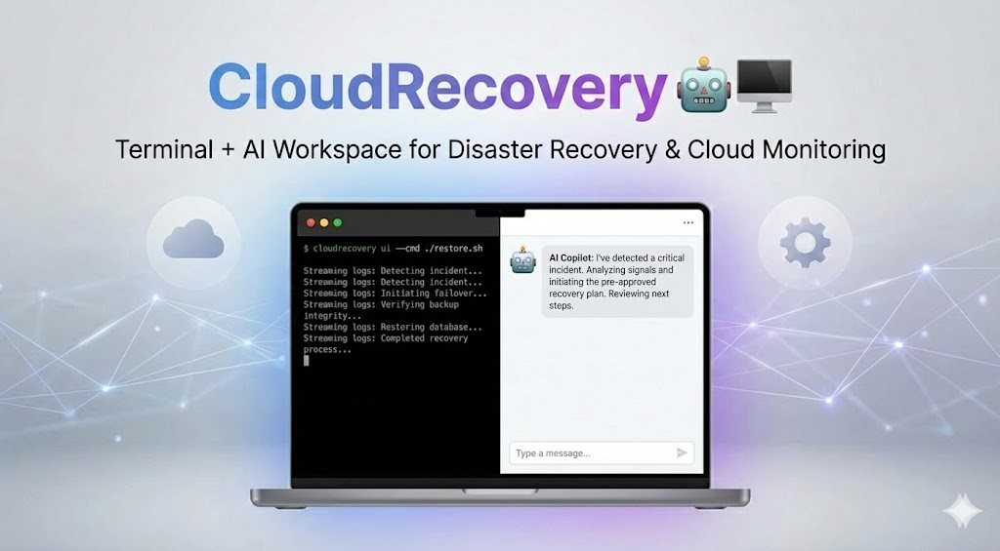
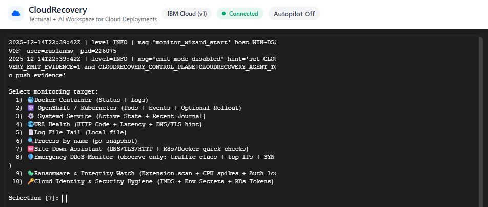
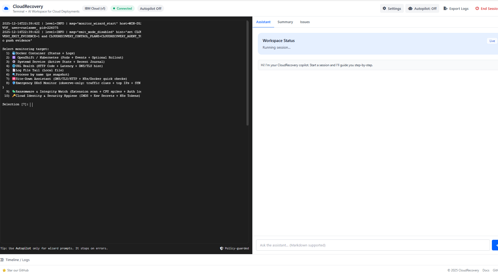

# CloudRecovery 🛟🤖🖥️
**Terminal + AI Workspace for Disaster Recovery, Cloud Monitoring, Site-Down Assistant & DDoS Safeguard (Local-First, Enterprise-Ready)**  
*(“second brother” of CloudDeploy — same architecture, new mission: restore service fast, safely, and auditably.)*




If you've ever lost hours during an outage because logs are scattered, tools are inconsistent, approvals are unclear, or everyone is guessing — **CloudRecovery** is for you.

CloudRecovery is a **recovery workspace** that runs your **real ops/DR CLIs** in a browser (left panel), while an **AI SRE copilot** (right panel) consumes **sanitized, live signals** (alerts/events/logs/synthetics) and turns chaos into an **executable, policy-guarded recovery plan** — with **always-on monitoring agents** and **autopilot modes** designed for **safe MTTR reduction**.

⭐ If CloudRecovery saves you even one incident, please **star the repo**.

---

## ✨ Highlights

- 🖥️ **Real Terminal in the Browser** (PTY-backed, not fake logs)
- 🔁 **Live Streaming Output** + prompt detection (CloudDeploy DNA)
- 🤖 **AI Copilot** reads **sanitized** terminal tail + incident signals
- 🎯 **Plan → Approve → Execute** recovery workflow (commands are never executed silently)
- 🧰 **MCP Tool Server** (same tool layer powers UI + agents — no duplicated automation)
- 🧾 **Audit-Friendly UX**: timeline, evidence snapshots, approvals, post-incident summary
- 🟥 **OpenShift (OCP) Support**: watch events/pods, rollout actions, safe restarts/rollback (policy-gated)
- ☁️ **Hybrid Estate Support**: OpenShift + Oracle instances + EC2 instances
- 🧑‍✈️ **Human-in-the-loop by default** (prod-safe), **Autopilot when enabled**
- 🕒 **24/7 Monitoring via Linux Agent daemon** (systemd service)
- 🆘 **Site-Down Assistant**: DNS/TLS/HTTP triage + Docker/K8s quick hints
- 🛡️ **Emergency DDoS Monitor (observe-only)**: top talkers + SYN flood hints + latency/5xx triggers
- 🦠 **Ransomware & Integrity Watch (heuristic)**: suspicious file extensions + high CPU + auth hints
- 🔑 **Cloud Identity & Security Hygiene (heuristic)**: IMDS exposure + risky env vars + K8s SA token checks
- 🧪 **Production-grade interactive monitor script**: `scripts/monitor_anything.sh` with Docker/K8s listing + mode selection


---

## 🧠 What is CloudRecovery?

CloudRecovery combines **four** things into one workflow:

### 1) Web Workspace (Terminal + AI)
- Runs a real PTY-backed terminal session in your browser
- Streams output live
- Detects interactive prompts & steps
- Shows **Assistant / Summary / Issues** in a clean enterprise UI

### 2) AI Incident Copilot
- Reads **redacted** terminal output + evidence (redaction by default)
- Explains what’s happening in plain language
- Produces **ranked hypotheses**
- Generates executable plans and runbooks
- Helps troubleshoot failures with safe, actionable steps

### 3) MCP Server (Tooling Interface)
- Exposes terminal + recovery actions as tools (stdio MCP)
- Enables external orchestrators/agents to observe and act (policy-guarded)
- Same tool layer powers UI autopilot

### 4) Always-on Linux Agents (24/7)
- A daemon installed on Linux hosts (systemd)
- Continuously collects health + OpenShift signals + synthetics
- Pushes evidence to the control plane
- (When enabled) executes **approved runbooks** under policy gates

---


## 🏢 Why teams adopt CloudRecovery (Enterprise mindset)

- 👩‍💻 **Faster onboarding:** same recovery UX across engineers and environments
- 🔥 **Lower MTTR:** less “where do I look?” time — evidence is pulled automatically
- 🧾 **Audit-ready:** evidence + actions + approvals + timeline export
- 🛡️ **Safe automation:** policies + risk labels + approvals + two-person gates
- 🧩 **Extensible:** add providers, WAF/CDN connectors, runbook packs, and policy packs
- 🏠 **Local-first / Bastion-friendly:** run in an ops workstation, jump host, or hardened runner

---

## 🧱 Architecture (Control Plane + Agents)

### Control Plane (FastAPI + Web UI)
- Hosts the terminal workspace + AI copilot
- Receives evidence from agents (and local scripts)
- Streams evidence via WebSocket: **`/ws/signals`**
- Agent APIs:
  - `POST /api/agent/heartbeat`
  - `POST /api/agent/evidence`
  - `GET  /api/agent/commands` (poll channel; can be upgraded to WS)
  - `POST /api/agent/command` (enqueue)
  - `GET  /api/evidence/tail`
- Health endpoint: **`GET /health`**
- Session controls (recommended for production):
  - `POST /api/session/stop`
  - `POST /api/autopilot/disable`
  - `GET  /api/session/status`

### Agent (Linux systemd daemon)
- Collectors:
  - `agent:host` (CPU/mem/disk)
  - `agent:ocp` (events/pods, CrashLoopBackOff detection)
  - `synthetics` (DNS/TLS/HTTP checks when configured)
- Pushes evidence to control plane continuously
- (Optional) executes safe runbooks when autopilot enabled and policy allows

### Local Interactive Monitor Script (Operator-Driven)
CloudRecovery ships/uses a production-grade interactive script (example: `scripts/monitor_anything.sh`) that:
- Lists **running Docker containers** and lets the user select one
- Lists **Kubernetes namespaces/deployments** and lets the user select targets
- Includes **Site-Down Assistant** and **Emergency DDoS Monitor (observe-only)**
- Can optionally **push evidence** to the control plane using env vars

---

## 📦 Install

```bash
pip install cloudrecovery
````

CloudRecovery runs locally and uses **your system tools** (`oc` / `kubectl` / cloud CLIs / SSH / etc).
No vendor lock-in: the AI provider is configurable.

---



## ✅ Prerequisites

### System Requirements

* Python **3.11+**
* macOS / Linux recommended (PTY-based runner)
* Windows supported via **WSL2** (recommended)

### OpenShift Requirements (OCP features)

* `oc` installed and available in PATH
* kubeconfig present for the runtime user (control plane runner or agent)

### Hybrid (Oracle/EC2) Requirements

* Agent installed on Linux hosts where you want system-level telemetry
* systemd available

---

## 🚀 Quick Start (Control Plane UI)

Run the Web Workspace (Terminal + AI):

```bash
cloudrecovery ui --cmd bash --host 127.0.0.1 --port 8787
```

Open:

* [http://127.0.0.1:8787](http://127.0.0.1:8787)

Health check:

```bash
curl http://127.0.0.1:8787/health
```

> Tip: you can run **any** interactive CLI wizard — prompt detection is pluggable.

---

## 🧭 Quick Start (Interactive Monitoring Script)

If your repo includes `scripts/monitor_anything.sh`:

```bash
chmod +x scripts/monitor_anything.sh
./scripts/monitor_anything.sh
```

### Run inside CloudRecovery UI

```bash
cloudrecovery ui --cmd ./scripts/monitor_anything.sh --host 127.0.0.1 --port 8787
```

### Optional: Push evidence from the script to the control plane

```bash
export CLOUDRECOVERY_CONTROL_PLANE="https://cloudrecovery.example.com"
export CLOUDRECOVERY_AGENT_TOKEN="REPLACE"
export CLOUDRECOVERY_AGENT_ID="monitor-wizard-1"
export CLOUDRECOVERY_EMIT_EVIDENCE="1"
./scripts/monitor_anything.sh
```

> The script is **local-first** and **observe-only** by default (no automatic remediation).

---

## 📡 Install the Linux Agent (24/7 monitoring)

### 1) Create agent config

```bash
sudo mkdir -p /etc/cloudrecovery
sudo cp cloudrecovery/agent/agent.yaml.example /etc/cloudrecovery/agent.yaml
sudo nano /etc/cloudrecovery/agent.yaml
```

Example:

```yaml
agent_id: "agent-ocp-prod-1"
control_plane_url: "https://cloudrecovery-control-plane.example.com"
token: "REPLACE_WITH_SHARED_SECRET"
env: "prod"
autopilot_enabled: false
synthetics_url: "https://your-service.example.com/health"
poll_interval_s: 15.0
openshift_enabled: true
host_enabled: true
```

### 2) Install + start systemd service

```bash
sudo cp cloudrecovery/agent/systemd/cloudrecovery-agent.service /etc/systemd/system/
sudo systemctl daemon-reload
sudo systemctl enable --now cloudrecovery-agent
```

### 3) View logs

```bash
sudo systemctl status cloudrecovery-agent
journalctl -u cloudrecovery-agent -f
```

---

## 🔐 Agent Authentication

Control plane supports a shared token (upgrade to mTLS later).

Set on the control plane host:

```bash
export CLOUDRECOVERY_AGENT_TOKEN="REPLACE_WITH_SHARED_SECRET"
cloudrecovery ui --cmd bash --host 0.0.0.0 --port 8787
```

Agent config must match:

```yaml
token: "REPLACE_WITH_SHARED_SECRET"
```

---

## 🟥 OpenShift Features (Monitoring + Recovery Tools)

CloudRecovery adds OpenShift MCP tools through `oc`:

### Read-only tools (safe)

* `ocp.get_pods`
* `ocp.get_events`
* `ocp.rollout_status`
* `ocp.list_namespaces`

### Mutating tools (policy-gated)

* `ocp.rollout_restart` *(medium risk)*
* `ocp.scale_deployment` *(medium risk)*
* `ocp.rollout_undo` *(high risk — typically two-person in prod)*

> In **prod**, mutating actions default to **approval required**.

---

## 🧪 Synthetics (“Site-Down Assistant” primitives)

CloudRecovery ships built-in checks:

* DNS resolution
* TLS handshake
* HTTP status + latency

Run via API:

```bash
curl -X POST http://127.0.0.1:8787/api/synthetics/check \
  -H 'Content-Type: application/json' \
  -d '{"url":"https://example.com/health"}'
```

Agents can run synthetics continuously if `synthetics_url` is set in the agent config.

---

## 🧠 Langfuse (LLM-Agent Loops & Token Blowouts)

CloudRecovery treats **Langfuse** as an additional observable backend, alongside
OpenShift, hosts, and synthetics: an LLM agent stuck in a repeating call loop, or
burning 60,000 tokens on one request, lands in the same incident timeline as a
`CrashLoopBackOff`.

Langfuse works as a **cloud or local / self-hosted** backend, and is fully
optional — without the extra installed, CloudRecovery behaves exactly as before.

```bash
pip install "cloudrecovery[langfuse]"

export LANGFUSE_PUBLIC_KEY=pk-lf-...
export LANGFUSE_SECRET_KEY=sk-lf-...
# Cloud (EU): omit LANGFUSE_HOST.  Cloud (US): https://us.cloud.langfuse.com
# Local / self-hosted:
export LANGFUSE_HOST=http://localhost:3000
```

### CLI

```bash
cloudrecovery langfuse status                    # which deployment am I pointed at?
cloudrecovery langfuse scan --since-hours 24     # find loops + token outliers
cloudrecovery langfuse scan --annotate           # write findings back to Langfuse
cloudrecovery langfuse scan --markdown-out report.md
cloudrecovery langfuse diagnose <trace_id>       # step-by-step for one trace
```

`scan` exits non-zero when findings exist, so it can gate a cron job or CI step.

### What it detects

| Detector | Trigger | Evidence kind |
|---|---|---|
| Repeating call loop | The same block of span names repeats back-to-back (default ≥3×) | `langfuse_loop` |
| Token blowout | A trace breaches a hard ceiling (default 30,000) **or** sits ≥3σ above its peers | `langfuse_token_outlier` |

### Tools (policy-gated, same dispatch path as `ocp.*`)

| Tool | Kind | Approval |
|---|---|---|
| `langfuse.status` | read-only | none |
| `langfuse.scan` | read-only | none |
| `langfuse.diagnose` | read-only | none |
| `langfuse.annotate` | mutating (Langfuse only) | none — no production system is touched |

These are reachable from the web autopilot and from any external MCP client.

### Continuous collection

Findings become normalized `Evidence` (`source="agent:langfuse"`) pushed to the
same `POST /api/agent/evidence` endpoint the Linux Agent uses, so they flow into
the existing timeline, WebSocket stream, and AI copilot reasoning:

```bash
export CLOUDRECOVERY_CONTROL_PLANE=http://127.0.0.1:8787
python scripts/langfuse_agent_poller.py --once     # one poll, for testing
python scripts/langfuse_agent_poller.py            # poll every 60s
```

A runbook pack (`cloudrecovery/runbooks/packs/langfuse_agent_loop.yaml`) triggers
on the `langfuse_loop` evidence kind and walks scan → diagnose → annotate.

### Real-time prevention (`LoopGuard`)

The collector above is **reactive**: it reports that a loop already happened and
already burned tokens. It cannot reach into a running agent process to stop one
mid-flight. For that, embed the in-process circuit breaker in your agent:

```python
from cloudrecovery.langfuse_analysis.guard import LoopGuard, RunawayLoopError

guard = LoopGuard(max_consecutive_repeats=3, max_total_tokens=30_000)

while not done:
    node = plan_next_node(state)
    try:
        guard.step(node, tokens_used_so_far=state.total_tokens)
    except RunawayLoopError as e:
        state.outcome = "escalated"
        break
    state = run_node(node, state)
```

---

## 🔎 Sources of Truth (ground incidents in real code)

Everything above reasons about **symptoms** — a repeating span name, a
`CrashLoopBackOff`, a failed check. None of it has seen the code that produced
them. The Source-of-Truth Engine attaches the real repos and configs behind a
running system, so resolution cites `src/nodes/intake_gate.py:14` instead of
pattern-matching on trace names.

Open the **Sources** tab in the web workspace (next to Assistant / Summary /
Issues), or use the API directly.

### 1) Attach

Four source kinds:

| Kind | Use for |
|---|---|
| `github` | GitHub repo (PAT via env var) |
| `gitlab` | GitLab repo, including self-hosted |
| `local` | A path on-box, when CloudRecovery runs as a sidecar next to the service |
| `gitops` | A GitOps repo backing an ArgoCD Application — gives you something to **diff** against, not just search |

The critical field is **link to service** — the join key mapping a source to an
identity incidents already carry: a `service.name` from trace metadata, an
OpenShift `namespace`/`deployment`, or an ArgoCD Application name. A source with
no link is stored but never selected. Matching is exact and ANDed, never fuzzy:
attaching the wrong repo produces confidently wrong citations, which is worse
than returning nothing.

```bash
curl -X POST http://127.0.0.1:8787/api/sources \
  -H 'Content-Type: application/json' \
  -d '{
        "name": "blue-agent-core",
        "kind": "github",
        "url": "https://github.com/org/agent-core.git",
        "credential_env": "GITHUB_TOKEN",
        "service_links": [{"service_name": "blue-agent-core"}]
      }'

curl -X POST http://127.0.0.1:8787/api/sources/blue-agent-core/sync
```

### 2) Sync and index

Remote sources are shallow-cloned read-only into an isolated workspace — never a
credential-bearing production checkout. The index stores **file paths and symbol
names only**; content is re-read from the checkout on demand, keeping the stored
artifact small and limiting secret sprawl.

### 3) Correlate

Search terms come from the incident itself — span names from a `cycle`, container
names, config keys — not from an LLM, so correlation is reproducible. Ranked
matches are returned plus one **structurally-adjacent** file: a file that
*imports* the top match outranks one that merely mentions it, which is what
surfaces the graph-wiring file where a missing exit condition actually lives.

```bash
curl -X POST http://127.0.0.1:8787/api/sources/ground \
  -H 'Content-Type: application/json' \
  -d '{"evidence": {"kind":"langfuse_loop",
        "payload":{"service.name":"blue-agent-core",
                   "cycle":["intake_gate","injection_check"]}},
       "resolve": false}'
```

### 4) Three context tiers, by trust level

| Tier | Content | Trust |
|---|---|---|
| 1 | The diagnosis CloudRecovery measured itself | Highest |
| 2 | Correlated source snippets, labeled with file path | Grounded |
| 3 | Documentation (a registered URL) | Lowest — off by default |

Tier 3 is consulted **only** when tiers 1–2 find nothing, is never sufficient on
its own to justify a code change, and requires
`CLOUDRECOVERY_DOCS_FETCH_ENABLED=1` to fetch anything at all (otherwise the URL
is shown as a bare reference). No crawling — one registered page, never followed links.

### 5) Resolve

The same provider-agnostic LLM layer, now given grounded context. Two action
shapes:

* **App-code fix** — a specific change at a specific file/line, delivered as a
  reviewed diff.
* **Infra drift fix** — "revert commit abc123" or "re-sync the Application"
  rather than masking the cause with `ocp.rollout_restart`.

Every proposed action carries the decision from the same
`action_policy.validate_action()` gate that protects infra mutations today.

### Governance

* Read-only by default; credentials stored as env-var **names**, never values.
* Local sources confined to `CLOUDRECOVERY_SOURCE_ALLOWED_PATHS` (defaults to the
  working directory). Symlinks are resolved *before* the check, so they cannot escape.
* Tokens are scrubbed from all git output before it reaches a log, an API
  response, or a prompt.
* Snippets pass through source-aware redaction on top of the standard redactor.
* Detaching a source removes its workspace and index — and never touches a
  `local` source's own tree.

### Config

```bash
export CLOUDRECOVERY_SOURCE_ALLOWED_PATHS=/opt/services   # local-source allow-list
export CLOUDRECOVERY_SOURCE_WORKSPACE=/var/lib/cloudrecovery/ws  # clone workspace
export CLOUDRECOVERY_DOCS_FETCH_ENABLED=0                 # tier-3 docs, off by default
export GITHUB_TOKEN=...                                   # read-only scope is enough
```

### Status

Phase 1 as described above is implemented: manual attach, deterministic
grep/symbol correlation, three-tier context, and text-only recommendations. Not
yet implemented: embedding-based search for very large repos, live ArgoCD
cluster-vs-Git drift diffing, automatic pull-request handoff, and closed-loop
tracking of whether a fix stopped a recurrence.

---

## 🛡️ Site-Down Assistant & DDoS Safeguard

### Site-Down Assistant (Local-First)

Use this when your service is “down” and you need structured evidence fast:

* DNS failure vs TLS failure vs connect failure vs HTTP 5xx/4xx
* Optional quick hints from:

  * Docker container state/health
  * Kubernetes “bad pod” counts (CrashLoopBackOff, ImagePullBackOff, Pending)

Outputs explicit triggers like:

* `trigger=dns_fail`
* `trigger=tls_fail`
* `trigger=connect_fail`
* `trigger=http_5xx`

### Emergency DDoS Monitor (Observe-Only)

Designed for “is this a DDoS?” triage without making changes:

* HTTP latency + 5xx symptoms
* SYN-RECV state count hint (Linux best-effort)
* conntrack top destination ports (Linux best-effort)
* top talkers from origin access logs (nginx/apache, best-effort)
* emits an AI-friendly `next_checks` hint line (WAF, rate limits, bot score, autoscaling, LB health, top URLs)

> This does **not** block traffic. It’s a **safe triage tool** that helps responders decide the next action.

---

## 🧰 Runbooks (Recovery Packs)

Runbooks live here:

* `cloudrecovery/runbooks/packs/`

Included examples:

* `crashloopbackoff_openshift.yaml`
* `site_down_basic.yaml`

Runbooks define:

* triggers (what incident symptom they address)
* steps (actions/commands)
* gates (verification)
* rollback steps (if needed)

**Autopilot executes runbooks (not freeform LLM commands) in production setups.**

---

## 🤖 Autopilot Modes (safe by default)

CloudRecovery keeps CloudDeploy’s autopilot behavior **and adds incident-grade autopilot**:

### Mode 1: Guided Triage (prod-safe)

* evidence collection only
* read-only commands
* no state-changing actions

### Mode 2: Runbook Autopilot (recommended path to production automation)

* executes **pre-approved** runbook steps
* pauses at policy gates
* requires approvals for mutating steps in prod

### Mode 3: AI Plan Auto-Execution (dev/war-room opt-in)

* fast iteration mode
* still validated by policy engine
* enable only in explicitly configured environments

---

## 🛡️ Safety & Compliance Notes

### Redaction by default

Terminal logs sent to the AI are sanitized (`cloudrecovery/redact.py`):

* masks API keys/tokens/passwords
* masks Bearer tokens
* can optionally redact `.env` values while keeping keys

### Policy-guarded automation

* terminal command validation (`cloudrecovery/mcp/policy.py`)
* recovery action validation (`cloudrecovery/mcp/action_policy.py`)
* environment packs:

  * `cloudrecovery/policy/packs/prod.yaml`
  * `cloudrecovery/policy/packs/staging.yaml`

### Local-first

You run CloudRecovery locally / on a bastion / on a hardened recovery runner:

* no credential harvesting
* no remote terminal execution layer required
* commands execute in your PTY (you see them typing)

---

## 🚢 Deploy Control Plane on OpenShift

Manifest:

* `deploy/openshift/cloudrecovery-control-plane.yaml`

Apply:

```bash
oc apply -f deploy/openshift/cloudrecovery-control-plane.yaml
```

**Before applying:**

* replace `REPLACE_IMAGE`
* create secret `cloudrecovery-secrets` with key `agent_token`

---

## 🔧 Run as an MCP Server (stdio)

CloudRecovery can run as a tool server for external agents/orchestrators:

```bash
cloudrecovery mcp --cmd bash
```

Example tool call:

```bash
echo '{"id":"1","tool":"cli.read","args":{"tail_chars":1200,"redact":true}}' \
  | cloudrecovery mcp --cmd bash
```

---

## 🔌 LLM Provider Configuration

CloudRecovery uses `cloudrecovery/llm/llm_provider.py` and supports:

* watsonx.ai (default)
* OpenAI
* Claude (Anthropic)
* Ollama (local)

Example (watsonx.ai):

```bash
export GITPILOT_PROVIDER=watsonx
export WATSONX_API_KEY="YOUR_KEY"
export WATSONX_PROJECT_ID="YOUR_PROJECT_ID"
export WATSONX_BASE_URL="https://us-south.ml.cloud.ibm.com"
export GITPILOT_WATSONX_MODEL="ibm/granite-3-8b-instruct"
```

---

## 🏥 Production Health Monitoring & Testing

### Automated Health Checks (GitHub Actions)

CloudRecovery includes CI/CD health checks via `.github/workflows/health-check.yml`.

**What’s tested:**

* ✅ Server startup and health endpoint (`/health`)
* ✅ Agent authentication (token security)
* ✅ MCP tool registration (session, cli, policy tools)
* ✅ Policy engine (blocks dangerous commands, allows safe ones)
* ✅ Redaction functionality (masks secrets/API keys)
* ✅ Runbook discovery and schema validation
* ✅ Production readiness checks (required files, security configs)

**Triggers:**

* On push to `main` or `claude/**` branches
* On pull requests to `main`
* Every 6 hours (scheduled)
* Manual workflow dispatch

**Run locally:**

```bash
curl http://127.0.0.1:8787/health
pytest tests/ -v
make lint
```

---

## 🚨 Production Monitoring & Alerting

### Current Capabilities (Built-in)

#### 1) Real-time Evidence Stream (`/ws/signals`)

* Live WebSocket feed of incidents, alerts, health metrics
* Agent heartbeats every 15 seconds (configurable)
* Severity levels: `info`, `warning`, `critical`
* Sources: `agent:host`, `agent:ocp`, `synthetics`, `monitor_wizard`

#### 2) Agent Health Monitoring

* CPU, memory, disk usage tracking
* OpenShift pod status (CrashLoopBackOff detection)
* Synthetic checks (DNS, TLS, HTTP latency)
* Automatic buffering during network outages (agent-side)

#### 3) Web Dashboard

* Terminal output (left panel)
* AI copilot analysis (right panel)
* Live evidence timeline with timestamps
* Autopilot execution status

#### 4) Safety Controls

* Policy-guarded automation (validates commands before execution)
* Redaction by default (never sends secrets to LLMs)
* Approval gates (mutating actions require human approval in prod)
* Rollback support (runbooks include rollback steps)
* Audit trail (timeline export for post-incident review)

### Production Deployment Recommendations

#### Email/Slack Notifications (Recommended Integration Point)

CloudRecovery is designed to be extended with notifications.

```python
# Example integration point (not included by default)
async def send_admin_alert(incident, admin_emails):
    """
    Send email/Slack notification when critical incidents are detected.
    Include link to monitoring dashboard for real-time oversight.
    """
    if incident.severity == "critical":
        dashboard_link = f"https://cloudrecovery.example.com/?incident={incident.incident_id}"
        # send via SMTP/SendGrid/Slack webhook
```

**Environment variables for notifications:**

```bash
export CLOUDRECOVERY_SMTP_HOST="smtp.example.com"
export CLOUDRECOVERY_SMTP_PORT="587"
export CLOUDRECOVERY_SMTP_USER="alerts@example.com"
export CLOUDRECOVERY_SMTP_PASSWORD="***"
export CLOUDRECOVERY_ADMIN_EMAILS="admin1@example.com,admin2@example.com"

# Slack webhook (alternative)
export CLOUDRECOVERY_SLACK_WEBHOOK="https://hooks.slack.com/services/..."
```

#### Admin Monitoring Dashboard

```bash
cloudrecovery ui --cmd bash --host 0.0.0.0 --port 8787
# Put behind SSO/MFA/auth proxy in production.
```

#### Emergency Stop Mechanism (Built-in)

**Via API (if implemented in your control plane):**

```bash
curl -X POST http://127.0.0.1:8787/api/session/stop
curl -X POST http://127.0.0.1:8787/api/autopilot/disable
curl http://127.0.0.1:8787/api/session/status
```

**Via Web UI:**

* “Stop Autopilot”
* “Terminate Session”
* Full audit trail of actions

#### Production Deployment Checklist

* [ ] Agent authentication configured (`CLOUDRECOVERY_AGENT_TOKEN`)
* [ ] Production policy pack active (`cloudrecovery/policy/packs/prod.yaml`)
* [ ] HTTPS enabled (reverse proxy: nginx/Caddy)
* [ ] Notification integrations configured (email/Slack)
* [ ] Runbooks tested in staging first
* [ ] Admin access controls (SSO/MFA recommended)
* [ ] Evidence retention policy defined (GDPR/compliance)
* [ ] Incident response playbook (escalation ownership)
* [ ] Health checks enabled (scheduled CI)

---

## 🧪 Development

```bash
make sync
make test
make lint
```

Run UI:

```bash
cloudrecovery ui --cmd bash
```

---

## 🧩 Contributing

PRs welcome for:

* OpenShift enhancements (RBAC, API-watch collectors)
* new runbook packs (DR failover, DB restore, DDoS edge response)
* enterprise policy packs (two-person approvals, blast-radius rules)
* UI improvements (signals dashboard, timeline export)
* new MCP tools (WAF/CDN, DNS, monitoring adapters)

Guidelines:

* safe-by-default automation
* never leak secrets; respect redaction
* validate all actions server-side
* keep mutating actions explicit and auditable

---

## 🆘 Support / Community

If you hit a tricky incident edge-case:

* capture sanitized logs (Export Logs button)
* open an issue with evidence + terminal tail
* propose a new runbook pack for the scenario

⭐ If CloudRecovery helps your team recover faster, please **star the repo**.

---

## 📜 License

Apache 2.0 — see `LICENSE`.

---

## 🎉 What’s New (CloudRecovery vs CloudDeploy)

* ✅ 24/7 Linux Agent daemon (systemd)
* ✅ Evidence store + live signals WebSocket (`/ws/signals`)
* ✅ OpenShift monitoring + safe recovery actions (policy-gated)
* ✅ Synthetics checks (DNS/TLS/HTTP)
* ✅ Site-Down Assistant (explicit triggers + quick infra hints)
* ✅ Emergency DDoS Monitor (observe-only triage)
* ✅ Runbooks as code (packs) + rollback + verification gates
* ✅ Policy packs (prod vs staging) for enterprise adoption
* ✅ Automated health check workflow (CI/CD testing every 6 hours)
* ✅ Production monitoring & alerting documentation
* ✅ Emergency stop controls (API + Web UI)

**Made with ❤️ for SRE / DevOps teams who want lower MTTR without breaking production.**

